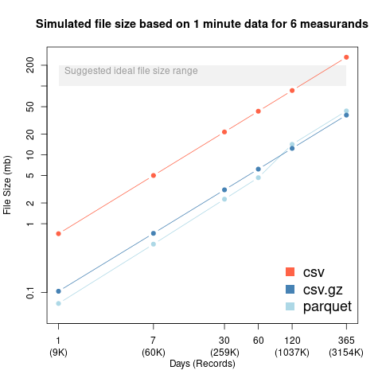

# Exploring file type and size

Various sources recommend file sizes of around 100-200mb so we set out to determine what it would take to get to that file size. For the simulation we are assuming 1 minute data for 6 different sensors though keep in mind that these values could be changed.

The figure shows the increase in file size as you increase the amount of data included in the file. For the x axis we are showing both the number of days (of 1 minute data with 6 variables) as well as the actual number of records that are in the file.

Based on these results we determine that it will be difficult to hit the optimal file size unless we combine locations. However, combining locations involves another layer of data management (e.g. which locations go to which files) that we have decided makes this option not worth it. Given the current results we have decided to use compressed csv files due to their smaller file size and ease of reading.

Based on this model each additional record would contribute 0.01225 kb to a csv.gz file.
